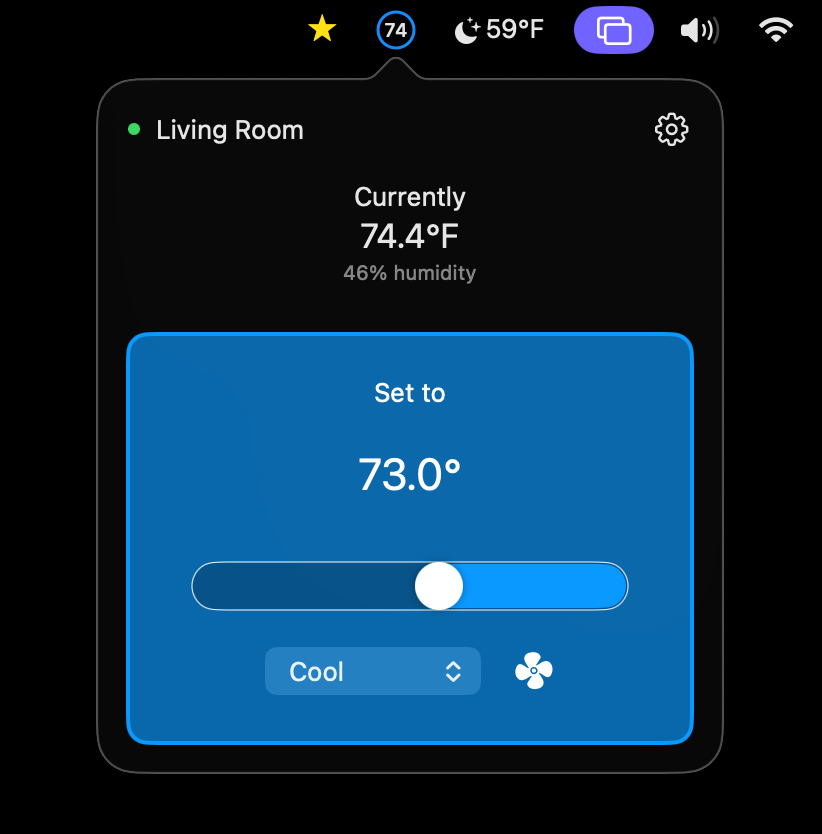

# Menu Bar Thermostat

An unofficial macOS menu bar thermostat controller for Google Nest devices using Google Smart Device Management.

Menu Bar Thermostat runs locally on your Mac, stores Google OAuth tokens in the macOS Keychain, and does not require a separate backend server. Under Google's current Device Access rules, each user needs their own Device Access project unless Google approves a commercial integration.



## Developer Repository

This repository is intended for developers who can configure their own Google Cloud, OAuth, Device Access, Pub/Sub, and Workload Identity setup. It will not build into a working app as-is after cloning because the required Google service configuration is intentionally omitted from the public repo.

## Status

This project is source-available for local builds and early public review. It is not affiliated with, endorsed by, or sponsored by Google, Nest, or Alphabet.

This repository is shared as a developer reference. Issues and pull requests are welcome, but active maintenance is not guaranteed.

Before publishing a signed release, verify that local Google project configuration is not bundled into the app artifact.

## Requirements

- macOS
- Xcode
- A Google Cloud project
- A Google Device Access project for the thermostat devices you want to control
- Pub/Sub permissions for receiving Device Access events

For the full Google setup path, see `Docs/google-device-access-setup.md`.

## Local Setup

1. Open `Menu Bar Thermostat.xcodeproj` in Xcode.
2. If Xcode prompts for signing, choose your own development team and replace the placeholder `com.example.MenuBarThermostat` bundle identifier with one you control.
3. Copy `Menu Bar Thermostat/Configuration/BuildSettings.example.xcconfig` to `Menu Bar Thermostat/Configuration/BuildSettings.local.xcconfig`.
4. Fill in:

```xcconfig
GOOGLE_OAUTH_CLIENT_ID =
GOOGLE_OAUTH_REVERSED_CLIENT_ID =
```

5. Copy `Menu Bar Thermostat/Configuration/AppConfig.example.plist` to `Menu Bar Thermostat/Configuration/AppConfig.local.plist`.
6. Fill in the runtime Google project values:

- `DEVICE_ACCESS_ENTERPRISE_ID`
- `PUBSUB_GOOGLE_CLOUD_PROJECT_ID`
- `PUBSUB_TOPIC_ID`
- `WORKLOAD_IDENTITY_AUDIENCE`
- `PUBSUB_SERVICE_ACCOUNT_EMAIL`

7. Build and run the `Menu Bar Thermostat` scheme.

The `*.local.xcconfig` and `*.local.plist` files are ignored by Git and should stay private.

## Local Token Storage

After Google Sign-In, Menu Bar Thermostat stores its Google OAuth token in your macOS login Keychain so it can restore your session on relaunch. macOS may ask whether "Menu Bar Thermostat wants to use your confidential information stored in 'auth' in your keychain." This is expected for local token restore; choose "Always Allow" if you want the app to reconnect without asking each launch.

## Tests

Run the macOS XCTest suite before opening a pull request:

```sh
xcodebuild -project 'Menu Bar Thermostat.xcodeproj' -scheme 'Menu Bar Thermostat' -configuration Debug -destination 'platform=macOS' -derivedDataPath /tmp/menu-bar-thermostat-test-audit CODE_SIGNING_ALLOWED=NO test
```

## Privacy And Security

See `PRIVACY.md` for local data handling and `SECURITY.md` for vulnerability reporting.

## License

Menu Bar Thermostat is available under the MIT License. See `LICENSE`.
